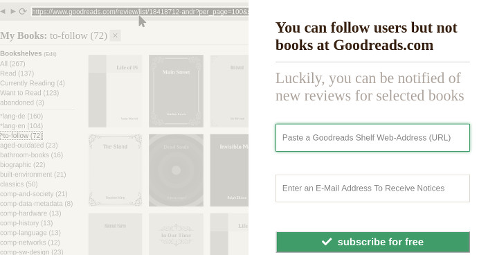

# André's Goodreads Toolbox as a Service

## The landing page

- [responsive](https://en.wikipedia.org/wiki/Responsive_web_design), transactional [landing page](https://en.wikipedia.org/wiki/Landing_page)
- [static](https://en.wikipedia.org/wiki/Static_web_page) website so I can easily host this on GitHub
- form submission is supported by external free services

Right half of the page: _Interaction_
- minimal design form: as less text and controls as possible 
- problem and solution statement 
- [privacy notice](privacy.txt) and consent checkbox (GDPR)
  
Left half of the page: _Information_
- slightly animated slides help users understand the form on the right side
- where do they find the info they have to input and how does the service or notifications mail look like 
- slides change when the user changes between the input controls
- slides are actually HTML and not real screenshots: I found this easier to update, fonts scale better and the page loads faster; screenshots need editing due to copyrighted book covers

### Current

The color scheme and typography is now more like the Goodreads.com website I refer to with the service.

### Older

## Copiers

You need to search-replace my email address datakadabra@gmail.com in _all_ files, and my Google Analytics code in index.html
