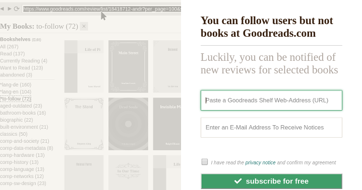

# André's Goodreads Toolbox as a Service

## The landing page

[Responsive](https://en.wikipedia.org/wiki/Responsive_web_design), [static](https://en.wikipedia.org/wiki/Static_web_page), [transactional landing page](https://en.wikipedia.org/wiki/Landing_page) I can easily host on [GitHub Pages](https://pages.github.com/) for free:
- form submission is supported by external free services, plain HTML5 form validation
- form contains as less elements as possible, so filling of this form seems like less work
- color scheme and typography refer to the Goodreads.com website
- problem statement (why) -> solution statement -> call to action
- [privacy notice](privacy.txt) and consent checkbox (GDPR)
- left half of the page: slightly animated informative slides 
- slides help users understand the form: where do they find the info they have to enter etc
- slides change when the user changes between the input controls
- slides aren't real screenshots: HTML easier to update, loads faster; screenshots need editing due to copyrighted book covers

### Observations:

- most subscribers don't use a special-purpose shelf with selected books but paste their whole "read" or "wishlist" shelves
- some users subscribe multiple times with different shelves so that each is checked (could be achieved with a single special-purpose shelf too)
- <small>technical 'lessons learned' can be found in the comments of the source files</small>

### Older:

## Copiers

You need to search-replace my email address datakadabra@gmail.com in _all_ files, and my Google Analytics code in index.html
